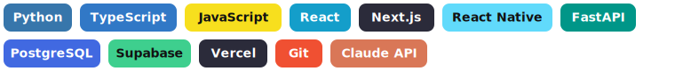

# Hi, I'm Tanuj 👋

**CS student & early-stage founder building AI infrastructure tools.**

🌐 [tanujk.com](https://tanujk.com) &nbsp;·&nbsp; 💼 [LinkedIn](https://linkedin.com/in/tanujkart)

---

## 🛠️ Tech I work with

---

## 🚀 Featured Projects

- **[thinkclear](https://thinkclear.net)** — Smart-glasses platform with real-time facial recognition and AI-powered memory assistance, built for memory-impaired users. Demoed at M&TSI 2025 · 400K+ interactions.
- **[tagopt](https://tagopt.com)** — AI-powered hashtag optimization engine that reads platform algorithms and post intent to surface high-signal tags — an SEO layer for organic content growth.
- **[nemo](https://github.com/tanujkart/nemo)** · [Devpost](https://devpost.com/software/nemo-7vrum0) — Autonomous underwater vehicle for real-time aquatic environmental monitoring, paired with a live global modeling dashboard.
- **[voice-assistant](https://github.com/tanujkart/voice-assistant)** — macOS push-to-talk voice assistant that answers questions about your Google Calendar, Tasks, and Gmail out loud.

---

## 📫 Reach me

Building in public — browse the repos above, or find more of my work at **[tanujk.com](https://tanujk.com)**.
